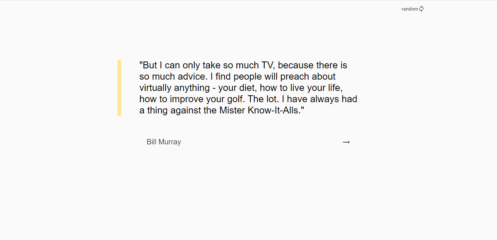

<h1 align="center">Random Quote Generator</h1>

<div align="center">
   Solution for a challenge from  <a href="http://devchallenges.io" target="_blank">Devchallenges.io</a>.
</div>

<div align="center">
  <h3>
    <a href="https://cofferandomquote.netlify.app/">
      Demo
    </a>
    <span> | </span>
    <a href="https://devchallenges.io/solutions/itmYIwKNN9VnqKN3AXEi">
      Solution
    </a>
    <span> | </span>
    <a href="https://devchallenges.io/challenges/8Y3J4ucAMQpSnYTwwWW8">
      Challenge
    </a>
  </h3>
</div>

<!-- TABLE OF CONTENTS -->

## Table of Contents

- [Overview](#overview)
  - [Built With](#built-with)
- [Contact](#contact)

<!-- OVERVIEW -->

## Overview



### Built With

- [HTML](https://developer.mozilla.org/en-US/docs/Web/HTML)
- [CSS](https://developer.mozilla.org/en-US/docs/Web/CSS)
- [JS](https://developer.mozilla.org/en-US/docs/Web/JavaScript)

## How To Use

<!-- For example: -->

To clone and run this application, you'll need [Git](https://git-scm.com) and [Node.js](https://nodejs.org/en/download/) (which comes with [npm](http://npmjs.com)) installed on your computer. From your command line:

```bash
# Clone this repository
$ git clone https://github.com/CoffeJeanCode/random-quote-challenge

# Install dependencies
$ npm install

# Run the app
$ npm start
```

## Contact

- Website [Jean Pierre Ortiz Murcia](https://coffejeancode.vercel.app/)
- GitHub [@CoffeJeanCode](https://github.com/coffejeancode)
